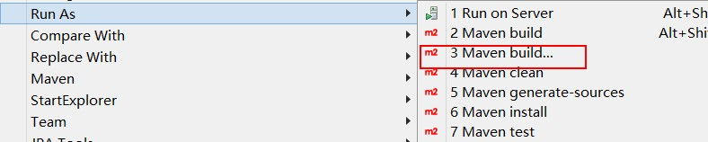
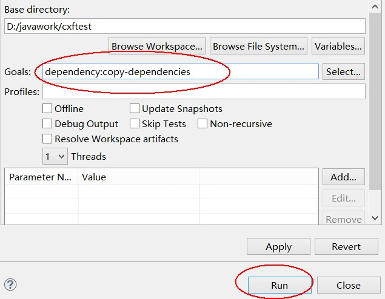

转自:https://www.cnblogs.com/sandea/p/6262866.html?utm_source=itdadao&utm_medium=referral

在WEB-INF/lib下建立一个pom.xml文件

在eclipse中，选择项目的pom.xml文件，点击右键菜单中的Run As,见下图红框中，在弹出的Configuration窗口中，输入 dependency:copy-dependencies后，点击运行
  maven项目所依赖的jar包会导出到targed/dependency目录中。

