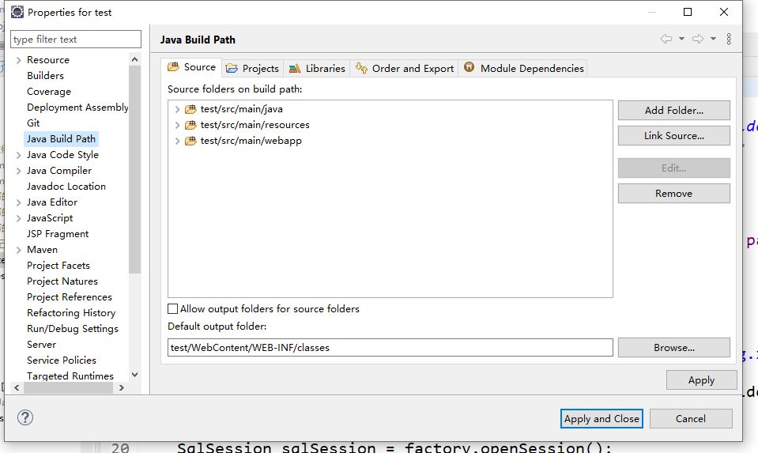

source folder:

存放.java源文件的根目录;

output folder：.class编译输出的根目录；

纯“java project”中，一般把"src"设置为source folder，把bin设置为output folder；

“web project”中，一般把"src"设置为source folder，把WEB-INF/classes设置为output 。可以通过：右键工程名－>"properties"->"java build path"->"source"->"output folder"->工程名/WEB-INF/classes来设置class目录为编译输出目录。对于web项目，一定要将classes文件夹作为编译后的输出目录。

记得要把文件都加到build path之下才能编译并且输出到dafault output folder所指定的目录下

