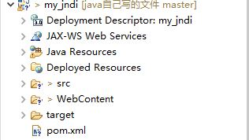
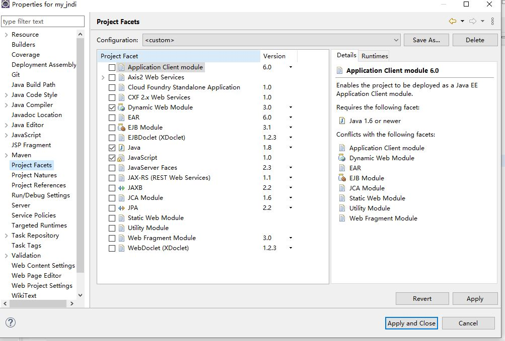
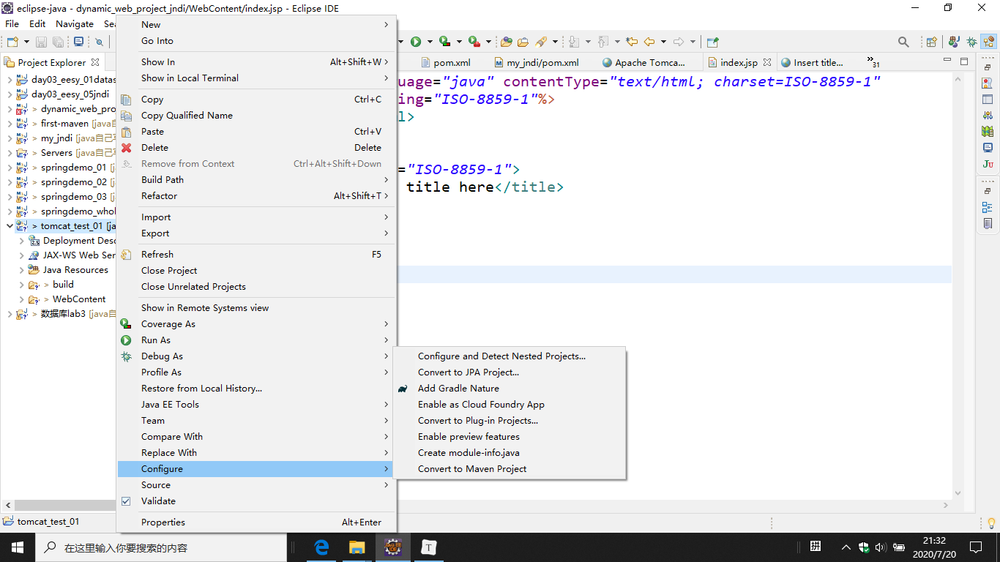

无论是从maven-->web还是 dynamic web project配置完成后都应该是上图的目录结构。

### maven->web的配置：

在项目上点properties。

再点 Project Facets勾选dynamic web module和JavaScript，如下图：

### dynamic web project 添加maven:

在项目上点击，config-->convert to maven project即可完成转换。如下图:

