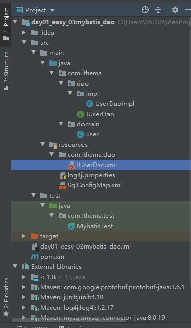

mybatis配置文件详解链接：https://www.jianshu.com/p/b3fc571e6da5

```xml
<!-- SqlConfigMap.xml-->

<?xml version="1.0" encoding="UTF-8"?>
<!DOCTYPE configuration
        PUBLIC "-//mybatis.org//DTD Config 3.0//EN"
        "http://mybatis.org/dtd/mybatis-3-config.dtd">
<!--mybaits的主配置文件 -->

<configuration>

    <!-- 配置环境-->
    <environments default="mysql">
        <environment id="mysql">
            <!-- 配置事务类型-->
            <transactionManager type="JDBC"> </transactionManager>
            <!-- 配置数据源(连接池)-->
            <dataSource type="POOLED">
                <!-- 配置数据库的四个基本信息-->
                <property name="driver" value="com.mysql.cj.jdbc.Driver" />
                <property name="url" value="jdbc:mysql://localhost:3306/test?serverTimezone=UTC" />
                <!-- 最后一个/是 数据库名称-->
                
                
                <property name="username" value="root" />
                <property name="password" value="456321" />
            </dataSource>
        </environment>
    </environments>

    <!-- 指定配置文件的位置 映射配置文件指的是每个dao独立的配置文件-->
    <mappers>
        <mapper resource="com/ithema/dao/IUserDao.xml"/>
    </mappers>
</configuration>
```


com.ithema.dao.IUserDao.xml

```xml
<?xml version="1.0" encoding="UTF-8"?>
<!DOCTYPE mapper
        PUBLIC "-//mybatis.org//DTD Mapper 3.0//EN"
        "http://mybatis.org/dtd/mybatis-3-mapper.dtd">

<!-- 确定该方法在哪个文件中-->
<mapper namespace="com.ithema.dao.IUserDao">
    <!--配置查询所有-->
    <!-- resultType得到的类型-->
    <select id="findAll" resultType="com.ithema.domain.user">
        select * from user
    </select>
</mapper>
```


### 改为注解形式：

修改SqlConfig.xml的mappers属性为：

```xml
<!-- 指定配置文件的位置 映射配置文件指的是每个dao独立的配置文件-->
<!-- 如果使用注解来配置的话 -->
<mappers>    
    <mapper class="com.ithema.dao.IUserDao"/>
</mappers>
```


再在com.ithema.dao.IUserDao.java这个接口文件中：

```java
public interface IUserDao {
    //查询所有操作,@Select
    @Select("select * from user")
    List<user> findAll();
}
```


### 条件查询

在IUserDao.xml中:

```xml
<select id="findUserByCondition" resultMap="userMap" parameterType="user">
        select * from user
        <where>
            <if test="userName != null">
                and username = #{userName}
            </if>
            <if test="userSex != null">
                and sex = #{userSex}
            </if>
            <if test="userId != null">
                and id =#{userId}
            </if>
        </where>
    </select>
```

自己理解的if test涵义大概是这个条件成立之后才能把后面的语句连上。


### 当想要让实体类的类名不和查询结果的类名保持一致时，需要配置resultMap

在IUserDao.xml中

```xml
<!-- 配置 查询结果的列名和实体类的属性名的对应关系 -->
<!-- type表示返回值的类型,大小写不敏感，但保持一致让人感觉更清晰  -->
    <resultMap id="userMap" type="user">
        <!--result column="数据库字段名" property="实体类属性" jdbcType="数据库字段类型"-->
        
        <!-- 主键字段的对应 -->
        <!-- 对于简单情况下id替换成result也没有问题。-->
        <id property="userId" column="id"/>
        
        <!--非主键字段的对应-->
        <result property="userName" column="username"/>
        <result property="userAddress" column="address"/>
        <result property="userSex" column="sex"/>
        <result property="userBirthday" column="birthday"/>
    </resultMap>

<!-- 定义User的resultMap-->
    <resultMap id="userAccountMap" type="User">
        <id property="id" column="id"/>
        <result property="username" column="username"/>
        <result property="address" column="address"/>
        <result property="sex" column="sex"/>
        <result property="birthday" column="birthday"/>
        <!-- 配置user对象中accounts集合的映射 -->
        <collection property="accounts" ofType="account">
            <!--  写成ofType和javatype都可以-->
            <id column="aid" property="id"/>
            <result column="uid" property="uid"/>
            <result column="money" property="money"/>
        </collection>
        <!--
        ·association–复杂类型联合;许多查询结果合成这个类型
        o嵌套结果映射– associations能引用自身,或者从其它地方引用,
        ·collection–复杂类型集合
        o嵌套结果映射– collections能引用自身,或者从其它地方引用

        此处互相替换是没有问题的
        -->
        
    </resultMap>
```


###### resultmap与resulttype的区别为：

对象不同、描述不du同、类型适用不同

一、对象不同

1、resultmap：resultMap如果查询出来dao的列名和pojo的属性名不一致，通过定义一个resultMap对列名和pojo属性名之间作一个映射关系。

2、resulttype：resultType使用resultType进行输出映射，只有查询出来的列名和pojo中的属性名一致，该列才可以映射成功。

二、描述不同

1、resultmap：resultMap对于一对一表连接的处理方式通常为在主表的pojo中添加嵌套另一个表的pojo，然后在mapper.xml中采用association节点元素进行对另一个表的连接处理。

2、resulttype：resultType无法查询结果映射到pojo对象的pojo属性中，根据对结构集查询遍历的需要选择使用resultType还是resultMap。

三、类型适用不同

1、resultmap：mybatis中在查询进行select映射的时候，返回类型可以用resultType，也可以用resultMap。

2、resulttype：resultType是直接表示返回类型的,而resultMap则是对外部ResultMap的引用，但是resultType跟resultMap不能同时存在。

##### collection和association:

collection(一对多) 元素的作用和association元素的作用差不多一样，事实上，它们非常类似，也是映射到JavaBean的某个“复杂类型” 属性，只不过这个属性是一个集合列表，即JavaBean内部嵌套一个复杂数据类型(集合)。和使用association元素一样，我们使用嵌套查询， 或者从连接中嵌套结果集。


### mybatis中的foreach标签:

在IUserDao.xml中

```xml
 <!-- 了解的内容：抽取重复的sql语句-->
 <!-- 后面用<include refid="defaultUser">相当于添加了这条sql语句-->
    <sql id="defaultUser">
        select * from user
    </sql>


<select id="findUserInIds" resultMap="userMap" parameterType="queryvo">
        <include refid="defaultUser"/>
        <where>
            <if test="ids != null and ids.size()>0">
                <!--ids 不为空且大于1时才能执行foreach-->
                <foreach collection="ids" open="and id in (" close=")" 
                item="uid" separator=",">
                    #{uid}
                    <!-- 这个#号后的取值是由item决定的-->
                </foreach>
            </if>
        </where>
</select>
```

foreach的几个属性：

- collection：表示集合。

- separator：表示隔离符号。

- item：表示集合的元素。

- open：开始的标志。

- close：结束的标志。

- index：表示集合的索引。


# 文件结构截图:



