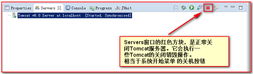

# 本文件夹下是一些关于jsp的内容


## 1.图解在Eclipse中启动和停止Tomcat服务器


(1)直接搜索servers


(2)启动的话servers界面下点击右上角的start servers,是个绿色的圆圈里面有个三角形


(3)暴力停止 Tomcat （相当于电脑被拔掉电源一样。没有执行关机的准备操作。），如下图所示：

(尽量不要这样！！！用下面那种)


(4)正常停止 Tomcat （相当于点击操作系统中的关机按钮，执行关机保存操作，然后关机），如下图所示：




## 2.jsp的生命周期

### (1) JSP初始化

容器载入JSP文件后，它会在为请求提供任何服务前调用jspInit()方法。如果您需要执行自定义的JSP初始化任务，复写jspInit()方法就行了，就像下面这样： 

```java
public void jspInit(){
  // 初始化代码
}
```

一般来讲程序只初始化一次，servlet也是如此。通常情况下您可以在jspInit()方法中初始化数据库连接、打开文件和创建查询表。 

### (2) JSP执行 

这一阶段描述了JSP生命周期中一切与请求相关的交互行为，直到被销毁。 
当JSP网页完成初始化后，JSP引擎将会调用_jspService()方法。 
_jspService()方法需要一个HttpServletRequest对象和一个HttpServletResponse对象作为它的参数，就像下面这样： 

```java
void _jspService(HttpServletRequest request,
                 HttpServletResponse response)
{
   // 服务端处理代码
}
```

_jspService()方法在每个request中被调用一次并且负责产生与之相对应的response，并且它还负责产生所有7个HTTP方法的回应，比如GET、POST、DELETE等等。 

### (3) JSP清理 

JSP生命周期的销毁阶段描述了当一个JSP网页从容器中被移除时所发生的一切。 
jspDestroy()方法在JSP中等价于servlet中的销毁方法。当您需要执行任何清理工作时复写jspDestroy()方法，比如释放数据库连接或者关闭文件夹等等。 
jspDestroy()方法的格式如下： 

```java
public void jspDestroy()
{
   // 清理代码
}
```

大概就是正常停止tomcat的时候执行


## 3.JAVA中<%! %>和<% %>的区别？

<%! %>里面定义的属性是成员属性,相当于类的属性,方法相当于是全局的方法,相当于是类里面的方法.但是它是不可以进行输出的,因为它只是进行方法的定义和属性的定义。　　

<% %>这个里面可以进行属性的定义,可以输出内容,但是它不可以进行方法的定义,因为这对标签里面的内容将来是在此jsp被编译为servlet的时候放在了_jspService()方法里面的,这个方法就是服务器向客户端输出内容的地方,它本身就是一个方法,所以如果你在它里面定义方法的话,那么就相当于是在类的方法里面嵌套定义了方法,这在java里面是不允许的。但是你可以在里面定义自己的私有变量，因为方法里面也可以定义变量，也可以调用方法，但是唯独不可以再定义方法了。　　

<%! %>是用来定义成员变量属性和方法的,<%%>主要是用来输出内容的,因此如果涉及到了成员变量的操作,那么我们就应该使用<!%%>,而如果是涉及到了输出内容的时候,就使用<%%>。


## 4.中文编码问题

如果我们要在页面正常显示中文，我们需要在 JSP 文件头部添加以下代码： 

```jsp
<%@ page language="java" contentType="text/html; charset=UTF-8"
    pageEncoding="UTF-8"%>
```

